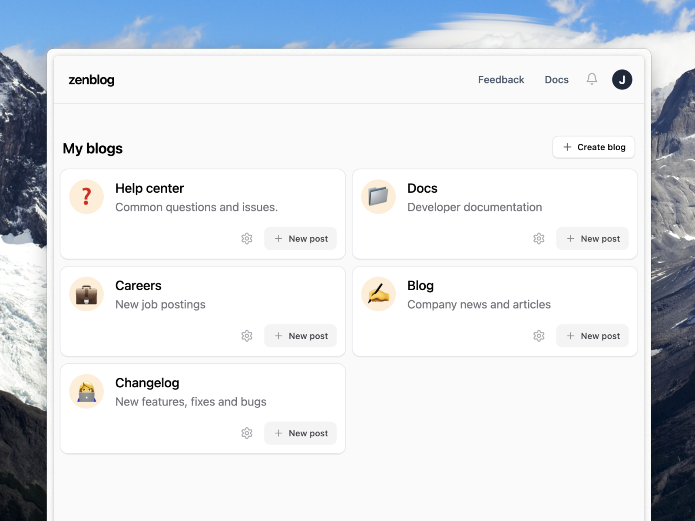

  
  </a>

  <h1 align="center"><tt>Zenblog</tt></h1>
  <h2 align="center">Simple, open source blogging</h2>

    <a href="https://zenblog.com"><strong>Website</strong></a> » 
    <a href="https://twitter.com/zenbloghq">
    <strong>Twitter</strong>
    </a>
  

  
  

---

## 🏗️ Current Status

`Zenblog` is currently under heavy development. The initial public release is expected in 2024

---

## About

Zenblog is an open source, headless CMS for blogging. It's designed to be as simple to integrate as possible, while still providing a great user experience for both writers, readers and developers.

## Features

- As many blogs as you want
- Collaboration 🤼
- Fetch content from your website easily with the SDK
- Image hosting
- Analytics
- RSS feeds
- Webhooks
- API
- Self-hosting
- Custom themes
- Custom domains
- Easily fetch content from your website
- And more!

---

## Why

I wanted the ability to spin up a blog and fetch content from my website with ease. The same way you get a fully functional Postgres database with Supabase and connect to it in a few minutes, I wanted the same for my blog or content needs.

Headless CMS solutions are great, but they are often too complex and pricey for simple use cases. I wanted something that was simple to use, but still powerful enough to handle my needs.

In my opinion, headless CMS solutions are too pricey when you just want to fetch some text and images and render it in your website.

---

## Tech Stack

`Zenblog` is built with the following epic technologies & tools:

- [Supabase](https://supabase.com/) Database, Auth, Storage, Functions
- [NextJS](https://nextjs.org) Vue based FrontEnd & Backend + modules
- [Tailwind](https://tailwindcss.com/) CSS Engine
- [TypeScript](https://www.typescriptlang.org/) Needs no introduction

_p.s. Things will change over time!_

## Running Locally

To get a local copy up and running, follow these simple steps.

### Prerequisites

Here is what you need to be able to run Zenblog locally.

- Node.js (Version: >=20.x)
- NVM (Recommended) (Node Version Manager) (see https://github.com/nvm-sh/nvm)
- npm (see https://npmjs.com/)
- Docker
- Supabase CLI

### Setup

A step by step guide on how to set up the project locally will be available soon.

## Self Hosting

A self hosting guide will be available soon.

## Contributing

Zenblog is not ready for contributions yet. If you're interested in contributing, please reach out to me on [Twitter](https://twitter.com/jordienr). I still need to do a lot of work to get the project ready for contributions. Thanks for your interest!
